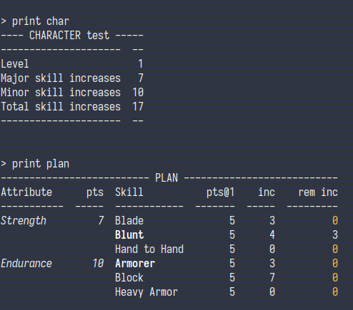

# oblivion-level-manager
A level manager utility for the game *The Elder Scrolls IV: Oblivion*.

This is command-line utility for creating and managing a character for the game. 
It's main purpose is to help with efficient leveling.
It is an interactive shell which you can use to modify and keep track of your in-game character stats. 

## Requirements
The application has been created and tested with python 3.8. The only dependency is package 'tabulate'. 
File `conda_env.txt` can be used to create a conda environment for this application.


## Example
Here is a minimal example.

### Character creation and initial setup

To create a new character named "Adventurer" (assuming you are in the path where the `oblivionlevelmanagercli.py` is 
and your python environment is setup correctly):
```bash
python ./oblivionlevelmanagercli.py new Adventurer
```
You will see the start-up message, followed by a prompt:
```
> 
```
To see a brief overview of your newly-created character, type:
```
> print character
```

Your character is created with all attributes set to 50 and all skills set to 5. To setup your character, you can use 
the `set-value` command. In the next, we set Strength to 60, and then Blade to 35 and Armorer to 25. We will also set
these two skills to be major skills.
```
> set-value attribute strength 60
> set-value skill blade 35
> set-value skill armorer 25
> set skill blade major
> set skill arm major
```
Note that the above commands are all valid. Each command has various abbreviations, for example instead of `set-value` 
you can simply type `set`. Also, attribute and skill names do not need to be typed fully (but at least 3 characters are 
required). 

You can now save your character by typing:
```
> save
```

### Progressing through a level
As you play, your character's skills increase. When a skill increases in-game, you should update the character using the
`increase-skill` (or simply `inc`). For example, if you increase your Blunt skill, you should type:
```
> inc blunt
```

When you meet the requirements, you can level-up with the `level-up` command. You need to choose which 3 attributes you
are going to improve during the level-up. For example, to improve Strength, Endurance, and Luck, type:
```
> level-up str end luc
```

### Planning a level
The main feature is planning a level in order to level-up efficiently, without increasing skills unnecessarily and
wasting attribute points. To create a plan, you can use the `plan` command which needs 3 or 2 (if you plan on improving 
Luck) attributes:
```
> plan str end
```
This creates a plan for improving Strength, Endurance, and Luck.

The following screenshot is from an example where we have run the `print character` and `print plan` commands:



The most important information is in the last 3 columns of the plan. Column `pts@lvl` shows the skill points at the
beginning of the level (here `lvl=1`), column `inc` shows how many times the skill increased in this level, and column 
`rem inc` shows the maximum remaining increases the skill can have before this level becomes "inefficient". The 
calculation of this column takes into account many parameters, such as overall skill increases, major/minor skill 
increases, as well as per-attribute skill increases.
## Program arguments

### General use:

```
usage: oblivionlevelmanagercli.py [-h] [--path PATH] [--run RUN]
                                  {new,load} ...

positional arguments:
  {new,load}
    new        Create a new character
    load       Load a character

optional arguments:
  -h, --help   show this help message and exit
  --path PATH  Path to load/save the character files
  --run RUN    Run a command or list of commands (separated by ;) and exit
```

### `new` command:

```
usage: oblivionlevelmanagercli.py new [-h] name

positional arguments:
  name        The name of the new character

optional arguments:
  -h, --help  show this help message and exit
```

### `load` command:

```
usage: oblivionlevelmanagercli.py load [-h] [--level LEVEL] name

positional arguments:
  name           The name of the character to load

optional arguments:
  -h, --help     show this help message and exit
  --level LEVEL  The level of the character to load (default: max available)
```

### List of commands:

```
print           Usage: print [all|character|attributes|skills|plan]
                Print information about your character, attributes, skills, or level-
                up plan
                Alternative names: show
set-value       Usage: set-value {level|attribute|skill} [name] value
                Utility to set-up your character after creation. Sub-commands
                'attribute' and 'skill' require a 'name' argument (i.e. name of the
                attribute or skill whose value is being set).
                Alternative names: setvalue, set-val, setval, set
increase-skill  Usage: increase-skill name [value]
                Increase a skill by 1 point. Argument 'value' can be used to increase
                (or decrease if negative) by more points.
                Alternative names: increase, inc-skill, inc
level-up        Usage: level-up att1 att2 att3
                Level up your character by one level. Command arguments are the three,
                unique attributes that you want to improve during the leveling up.
                Alternative names: levelup, level, up
plan            Usage: plan att1 att2 [att3]
                Set a plan for current level. You can choose 2 or 3 attributes to plan
                a level (you should only choose 2 attributes if you plan to level-up
                Luck). If you have already set a plan, it will bereplaced.
save            Saves the character to a (pickle) file. A different file is created
                for each character level. If a file exists for a given level, it is
                overwriten.
quit            Quits this program. No changes are saved.
                Alternative names: exit
help            Shows this help
```

